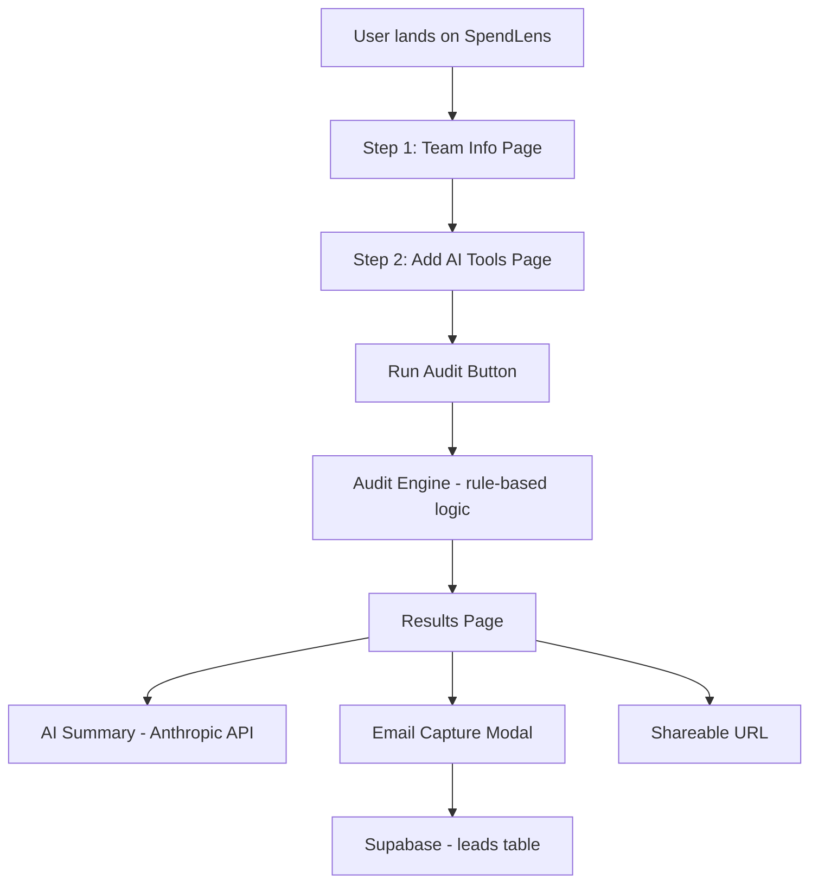

# Architecture

## System Diagram

## Data Flow

1. User fills in team size and use case on `/` page — saved to localStorage
2. User adds AI tools on `/tools` page — each tool has plan, seats, monthly spend — saved to localStorage
3. On clicking "Run My Audit", user is sent to `/results` page
4. Results page reads localStorage, runs audit engine (pure TypeScript rules, no AI)
5. Audit engine compares actual spend vs official prices, flags overspend, suggests downgrades
6. Anthropic API generates a 100-word personalized summary (falls back to template if API fails)
7. If user clicks "Save My Report", email + audit data is stored in Supabase leads table
8. Each audit gets a unique shareable URL with PII stripped

## Why This Stack

- **Next.js 14 App Router** — File-based routing, server components, easy Vercel deployment
- **TypeScript** — Type safety across the audit engine prevents calculation bugs
- **Tailwind CSS + shadcn/ui** — Fast styling with consistent design tokens
- **Supabase** — Postgres backend with instant REST API, free tier sufficient for MVP
- **Framer Motion** — Production-grade animations without writing CSS keyframes
- **Vercel** — Zero-config deployment, automatic preview URLs on every push

## Scaling to 10k Audits/Day

- Move audit engine to a Next.js API route to avoid client-side calculation limits
- Add Redis caching for audit results (same inputs = same output)
- Add a job queue (BullMQ) for email sending instead of inline API calls
- Add a CDN for the shareable result pages (they're static after generation)
- Add rate limiting per IP using Vercel Edge middleware
- Supabase free tier handles ~50k rows — upgrade to Pro for 10k audits/day